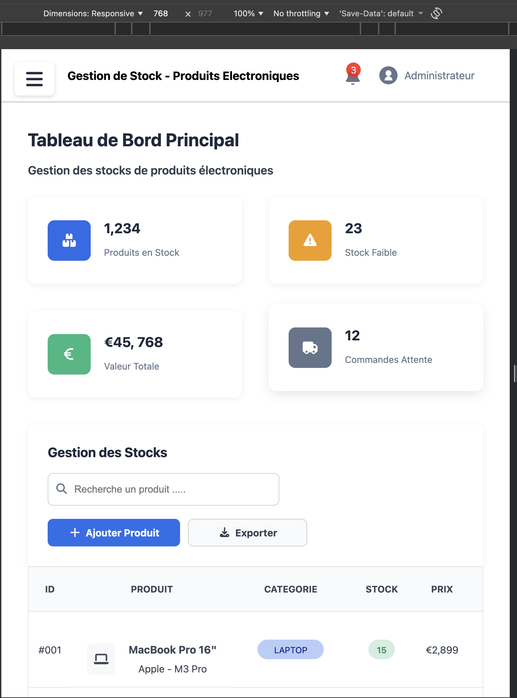
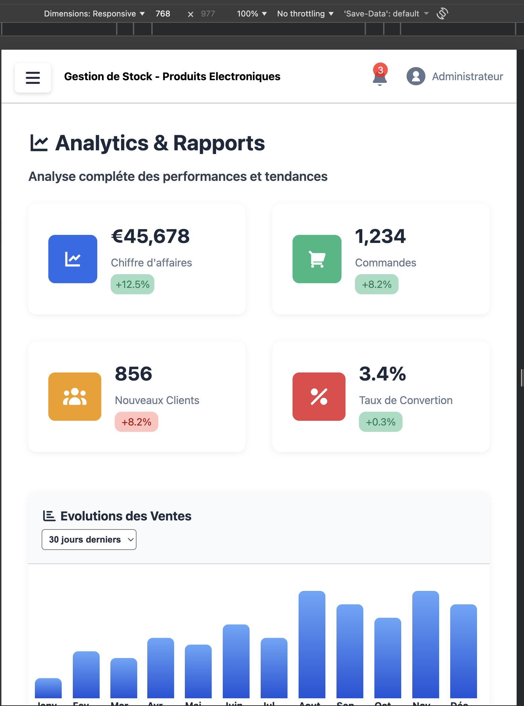
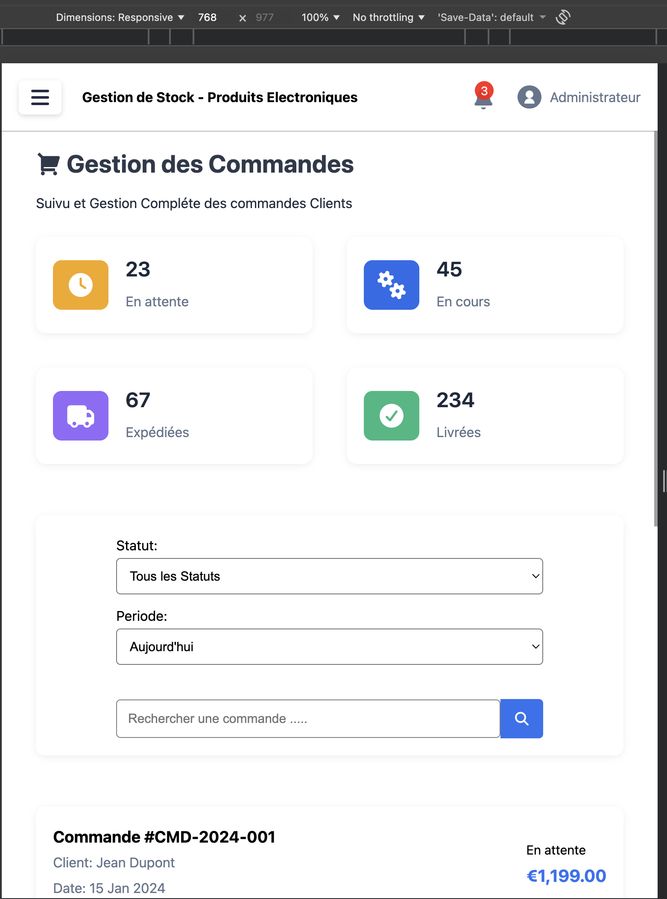
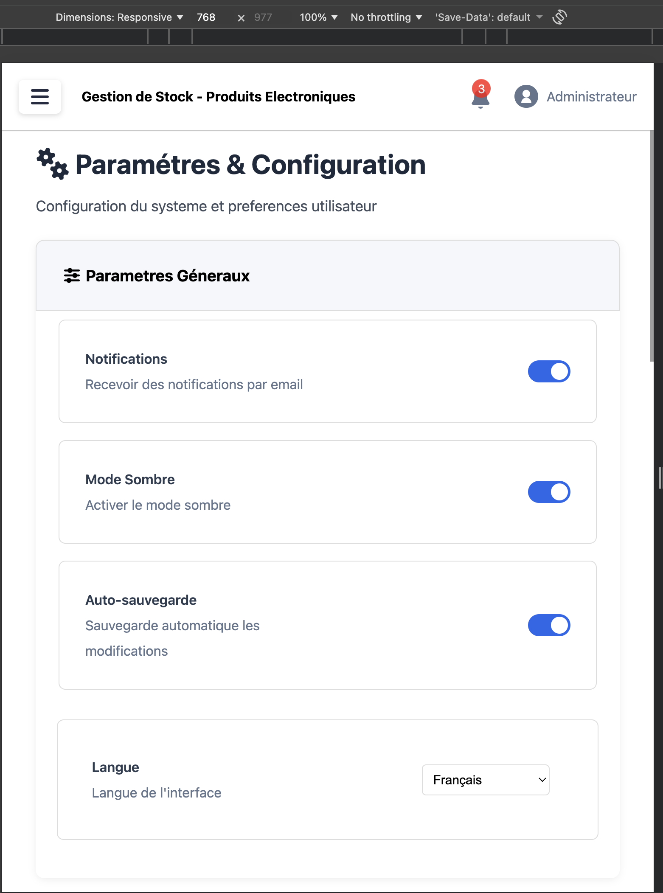
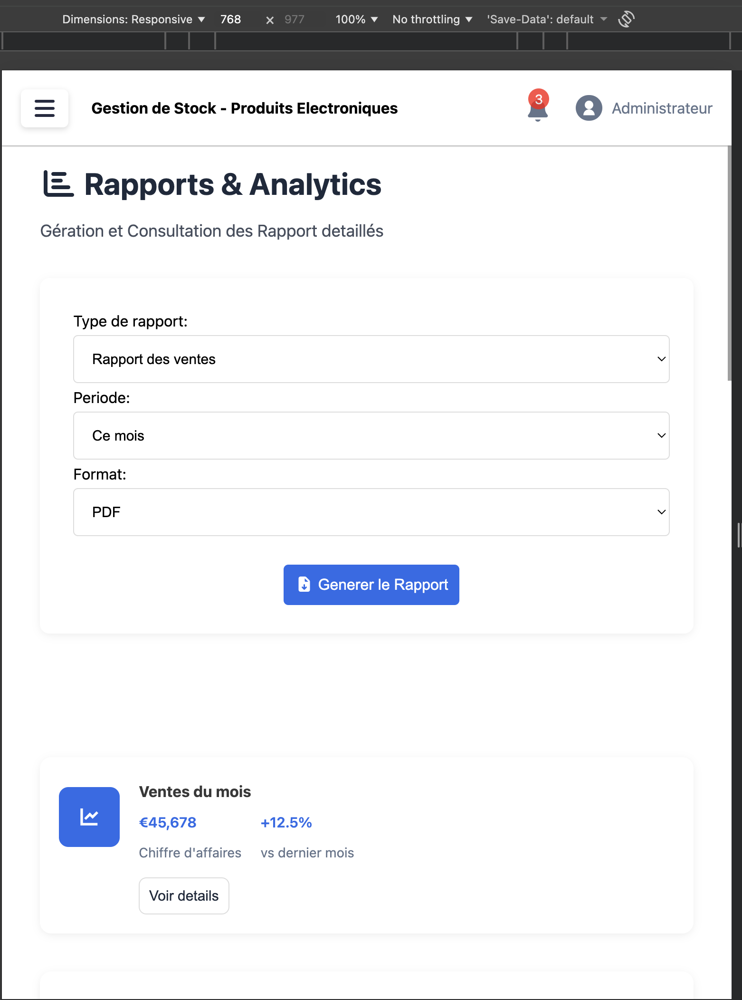
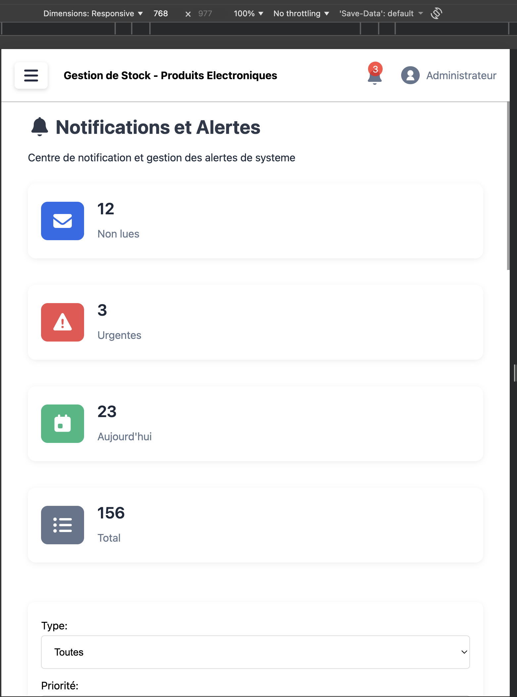
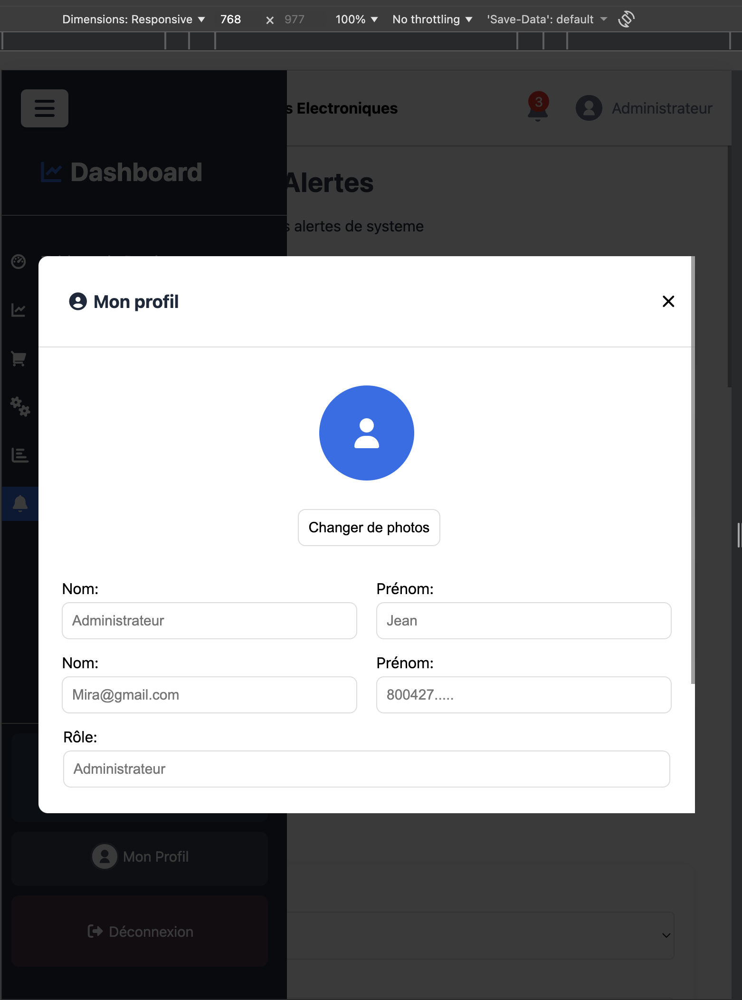

# Dashboard de Gestion

##  Description
Ce projet marque l’aboutissement de ma formation en HTML et CSS.  
Il a pour objectif de mettre en pratique l’ensemble de mes acquis, de consolider mes compétences et de démontrer ma maîtrise du développement web.  
C’est également une occasion d’exprimer ma créativité et mon sens du design à travers une interface moderne, responsive et professionnelle.

##  Objectifs
Parfaire et finaliser ma formation en HTML/CSS  
Mettre en pratique tous mes acquis  

##  Technologies utilisées
HTML5
CSS Responsive Design 
Font Awesome  (pour les icônes)  
Google Fonts (typographie principale)

##  Remarque personnelle
Ce projet a été une belle expérience d’apprentissage.  
Il m’a permis de renforcer mes bases en HTML et CSS, de mieux comprendre la structure d’un projet web complet, et surtout de développer mon sens du détail. 

##  Difficultés rencontrées
Au cours de ce projet, j’ai rencontré quelques difficultés, notamment :

 **L’adaptation du design en responsive** : ajuster les grilles, les tailles et les espacements pour que tout reste harmonieux sur tablette et desktop m’a demandé beaucoup d’essais sa m'a pris du temps mais au final j'ai abtenu un travail satisfaisant.  
**La structure du code CSS** : organiser les classes, éviter les répétitions et maintenir un code propre m’a appris à mieux structurer mes fichiers.  
Malgré ces difficultés, chaque erreur ou ajustement a été une étape d’apprentissage précieuse pour progresser et améliorer la qualité de mon travail.

## les captures

pour le tableau principal

pour analytic

pour commande

pour parametre

pour rapport

pour notification

pour profil

